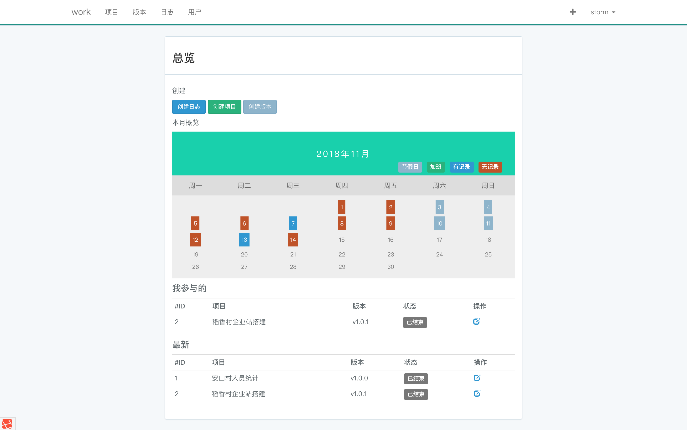

### SOOC_OA

## 简介

简单的工时统计系统  
包含项目，版本，和记录的增删改查  
每个项目和版本的工时统计，和图表展示  
日历形式展示节假日，已记录，未记录和加班情况

## 基于

Framework -laravel  
Css -bootstrap

## 

## 环境要求

php>=7.1  
mysql>=5.7  
composer  
npm  
git 

## 安装
>1. git clone https://github.com/zhuxiaojin/record.git  
>2. composer update  
>3. php artisan key:generate
>4. 修改.env的配置为你自己的数据库,同步修改APP_URL等参数，否则图片展示会出问题
>5. 初始化数据库 php artisan migrate  
>6. 填充基础数据 php artisan db:seed 
>7. 默认账号admin@admin.com 111111

## License

MIT -免费开源，请随意使用
